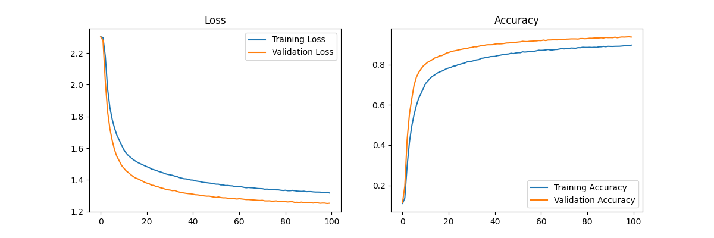
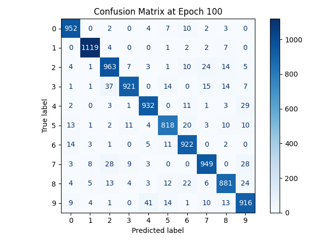
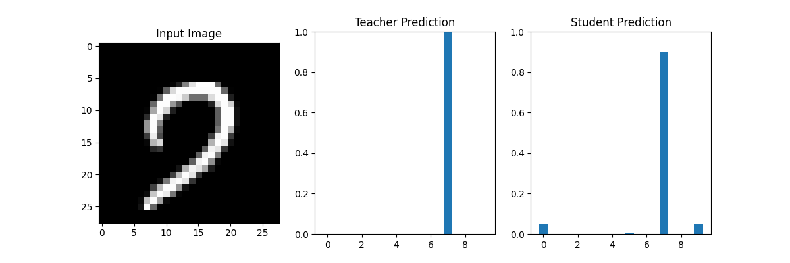

# MNIST Knowledge Distillation TF2.x Example

This project demonstrates how to use knowledge distillation to train a student model that learns from a pre-trained teacher model. This example uses the MNIST dataset for demonstration.

## Requirements

- Python 3.x
- TensorFlow
- NumPy
- Matplotlib
- Scikit-learn
- tqdm

## Installation

1. Clone this project locally:

   ```bash
   git clone https://github.com/yourusername/mnist-distillation.git
   cd mnist-distillation
   ```

2. Install the required Python packages:

   ```bash
   pip install -r requirements.txt
   ```

## Usage

### Train the Teacher Model

1. Run `train_teacher.py` to train the teacher model:

   ```bash
   python train_teacher.py
   ```

   After training, the best teacher model weights will be saved in `best_teacher_weights.h5`.

### Train the Student Model

1. Run `train_student.py` to train the student model:

   ```bash
   python train_student.py
   ```

   After training, the best student model weights will be saved in `best_student_weights.h5`.

### Knowledge Distillation

1. Run `distillation.py` to perform knowledge distillation:

   ```bash
   python distillation.py
   ```

   During the distillation process, confusion matrices and training charts will be generated and saved in the corresponding folders.

## Knowledge Distillation Benefits

Knowledge distillation is a powerful technique that allows a smaller student model to learn from a larger, pre-trained teacher model. This process can lead to several benefits:

- **Model Compression**: The student model is typically smaller and more efficient, making it suitable for deployment on devices with limited resources.
- **Improved Generalization**: By learning from the teacher model's predictions, the student model can achieve better generalization on unseen data.
- **Faster Inference**: A smaller student model can perform inference faster than a larger teacher model, which is crucial for real-time applications.

In this project, the `distillation_loss` function is used to combine the knowledge from the teacher model with the true labels. The function calculates a weighted sum of the soft loss (between the teacher's and student's predictions) and the hard loss (between the true labels and the student's predictions). This approach allows the student model to learn both the teacher's knowledge and the true data distribution.

```python
def distillation_loss(y_true, y_pred, teacher_pred, temperature=3.0, alpha=0.5):
    y_pred_soft = tf.nn.softmax(y_pred / temperature)
    teacher_pred_soft = tf.nn.softmax(teacher_pred / temperature)
    soft_loss = tf.reduce_mean(tf.keras.losses.categorical_crossentropy(teacher_pred_soft, y_pred_soft))
    hard_loss = tf.reduce_mean(tf.keras.losses.categorical_crossentropy(y_true, y_pred))
    return alpha * soft_loss + (1 - alpha) * hard_loss
```

## Results

- Confusion matrices and training charts will be generated during the training process, which can help you analyze the model's performance.
- The best model weights will be saved in `.h5` files, which you can use for model inference.

### Training Results

Below are some visualizations of the training results:

- **Training plots**: This chart shows the training and validation loss and accuracy over epochs, helping to understand the model's learning progress and convergence.

  

- **Confusion Matrix**: The confusion matrix provides insights into the model's classification performance, showing the true vs. predicted labels.

  

- **Test Results**: This image shows the original input image along with the output results from both the teacher and student models.

  

## Contribution

Welcome to submit issues and requests, or directly send Pull Requests to contribute code.
